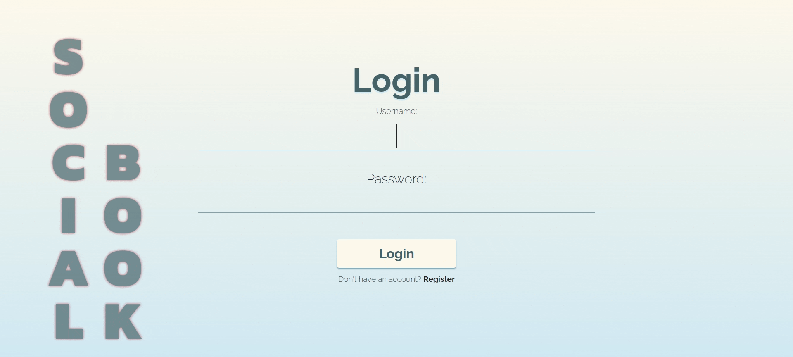
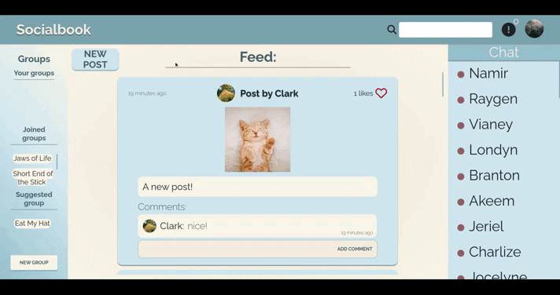
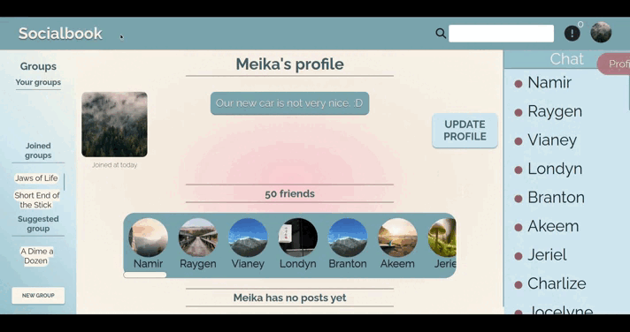
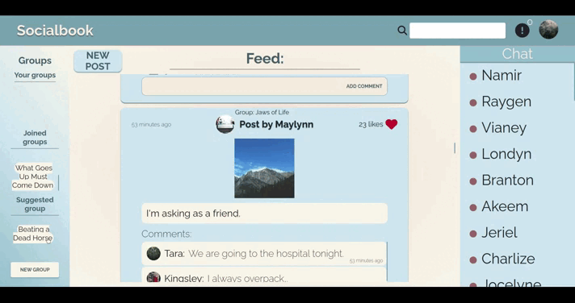
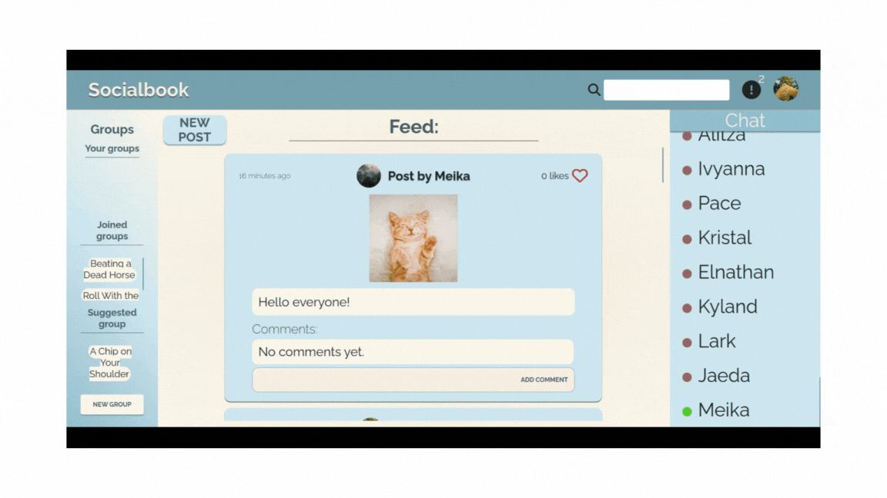
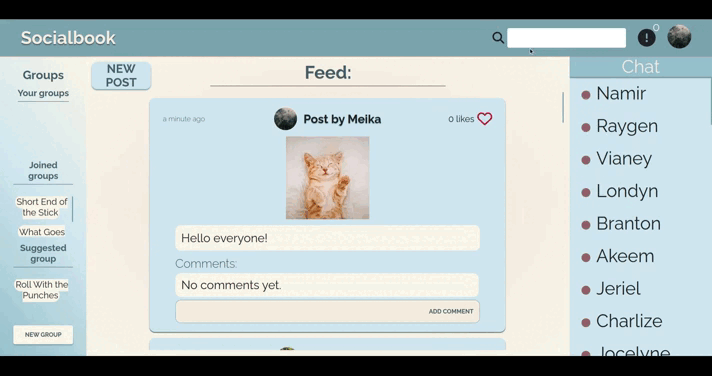

# SocialBook

A social web app clone, as part of my **developer portfolio**, built with Django.

## [**SocialBook** - *Live app*](https://socialbook.dev)

 ---

## Features

- User register, login and logout
- User profile with image, bio and password editing capability
- Friends functionality with friend/unfriend actions
- Feed posts creation with post body and optional image, commenting and like/unlike functionality 
- Group creation with join/leave actions, group posts, group editing, members management with approve/disapprove/kick actions
- Notifications system for:
    - Befriend/join requests
    - Post new comment/like
    - Profile and group actions
    - New chat message
- Live friends online/offline status updating
- Live chat messaging with chat history
- Live search functionality for usernames and group titles

 ---

### Contents

> [Home](#socialbook)

> [User profile](#user-profile)

> [Posts](#posts)

> [Groups](#groups)

> [Notifications](#notifications)

> [Online status](#online-status)

> [Client model](#client-model)

> [Chat messaging](#chat-messaging)

> [Search](#search)

> [Django](#django)

> [Known bugs](#known-bugs)

> [Future development](#future-development)

> [Deployment](#deployment)

---

### User profile

User handling is done using Django's auth user model combined with a OneToOne relationship with the Profile model, which includes basic information fields such as profile bio, image and joined_at timestamp, as well as some needed functionality fields, such as groups, friends, requested friends etc.

Validation is performed and extended (e.g. username uniqueness) in the views for the login and register forms and the user gets relevant feedback in case of invalid input. Access to the web app is prohibited for not logged in users, except for the login and register page.

The profile update page allows editing the profile bio, image and changing user password.

Friend/Unfriend/Accept requests are handled using AJAX, to and from the backend.

The profile model also stores the info_message field, which is a message to be displayed the next time the user navigates the web app. The information message informs the user for successful actions performed previously, like `'Post created'`, `'Group created'`, `'Password changed'` etc.

---

### Posts

Posts are created by users in the feed or as part of a group. They include the post body and an optional image. Posts can be liked and commented on. Each users feed shows the user's, the user's friends and the user's joined group's posts, ordered by time created. Each group page shows only the group posts. In the feed, the latest n number of posts are loaded, with n being a developer setting, and more n posts are loaded on feed scroll end. The user profile also includes the user's posts.

The owner of a post gets notified for new likes and comments on their post.

---

### Groups

Groups are created by a user. The user then becomes the group's owner, and is the only one who can edit the group details and manage members through the group detail page. The owner also gets notified for new group posts and join requests.

Join/Leave/Approve/Disapprove/Kick actions are handled using AJAX, to and from the backend.

The web app shows groups where user is the owner, groups where user is just a member and a suggested random group which the user is not a member of.

---

### Notifications

Notifications are mainly implemented through Django signals, after a model event, such as post_save, m2m_changed etc. The Notification model stores the user who receives the notification, the notification text, a timestamp, the model type and id of the event sender (e.g. Comment model) and a seen boolean.

The actual notification is sent to the user via websocket, specifically through an AsyncWebsocketConsumer of the Django channels package. It includes the notification text, timestamp, as well as a link to the relevant model detail page (e.g. for the Comment model, the specific Post detail page).

Each user's websocket channel is stored in the [Client](#client-model) model and is retrieved from it in order to receive the correct notifications.

A notification's seen status is set to true when it is included in the notifications dropdown of the navbar and the user opens it, or when the user visits the notifications home page. The number of unseen notifications is always displayed in the navbar and is changed accordingly by the websocket.

---

### Online status

Online status of a user is handled by the [Client](#client-model) model. A dedicated AsyncWebsocketConsumer is responsible for changing the model's online_status boolean value, which in turn causes a signal to send an updated online status for the user to each user's friend who is currently online. On connecting to the websocket, the boolean becomes true, while on disconnecting, false.

---

### Client model

The Client model has a OneToOne relationship with the User model and is responsible for storing the user's online status and for updating the user's notification and status channels on every new login. This is so that a user is reachable by another channel (e.g. to send a like notification from a user to another) without having to create a channel group of both users.

---

### Chat messaging

The chat window includes all friends and displays which of them are active. On opening a chat, the latest n number of messages from history are loaded, with n being a developer setting, and more n messages are loaded on scrolling up the chat log. The messages display differently depending on whether the user is the sender or not and are timestamped.

The ChatMessage model itself stored the two users as sender and receiver, the created timestamp and name of the chat group. This name is generated by the Chat AsyncWebsocketConsumer in the get_group_name function. The group name is essentially the users' usernames ordered and joined by `'-'`. This is so the group name is always unique for each pair of users and is easily stored.

The dedicated AsyncWebsocketConsumer is responsible for validating the user connecting as part of the respective channel group, setting the group name, loading chat messages from history, creating new ChatMessage objects and finally sending those messages serialized to the correct recipients.

---

### Search

Searching users and groups in the search bar works using AJAX calls to the Django view on every new character typed in the input bar. The view then performs filter and order_by queries and returns the serialized results. The results are categorized by users and groups and are displayed dynamically under the search bar.

On the submit event of the input bar, the user is redirected to the search results page, which shows the static results of the search query.

---

### Django

Django features, technologies and packages implemented:
- Basic MVC functionality
- Setting up static and media directories
- Using the environ package for environment variables
- Logged in validation
- Generic views and forms overriding
- Custom form validators
- Securing POST requests with built-in CSRF functionality
- Handling uploaded media
- Handling AJAX requests and responding with JSONResponse
- Template variables, logic, inheritance
- Humanize module for human friendly datetime information
- Custom template tags
- Passing backend variables to the frontend
- Using the admin panel to control the models
- Database relationships handling with the ORM
- More complex database queries
- Implementing signals
- Connecting to Postgresql database
- Setting up an ASGI server with daphne for handling both http and websocket
- AsyncWebsocketConsumers of the channels package
- Using redis as the cache for the channel layers
- Making sync and async functions work together

---

### Known bugs

- Occasionally, user online status remains true after closing browser window - websocket disconnecting. At first thought to be a frontend issue - not sending a connection closed, the `beforeunload` event was added to the document on the frontend with a connection closed message to the backend to assure the status change. Even with this change, the bug persists sometimes. To compensate, the user status is also set as false from the backend side, on the AsyncWebsocketConsumer disconnect function. Still, rarely, a user will appear online even though he is not logged in.

---

### Future development

- Make the frontend responsive for mobile
- Add seen messages feature
- Add group chats
- Add delete profile capability
- Require register validation with email link
- Add password reset with email capability
- Login with third party capability
- Add suggested friends page

---

### Deployment
Socialbook is deployed on **Heroku**, using *ElephantSQL* for the Postgresql database, *Upstash for Redis* for the channels handling on the redis part and *Cloudinary* as the media storage solution. The web app is available on the [socialbook.dev](https://www.socialbook.dev) domain name, secured with SSL.
